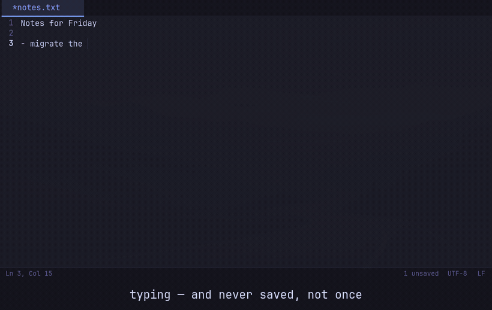
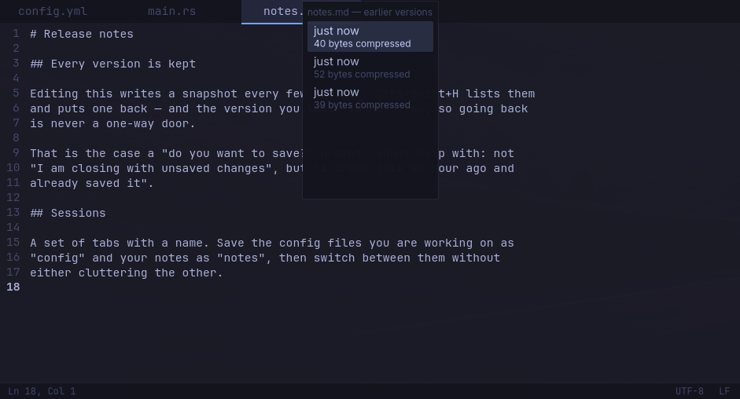

# f3note

**The text editor that does not lose your work.**

Windows Notepad's simplicity and Notepad++'s tabs, for Wayland, opening in
about 150ms. The speed is a consequence of keeping it small; not losing your
work is the point.



*Typing, `kill -9`, and opening it again. It was never saved once, and
`notes.txt` on disk is still empty — the recovered text came from f3note's own
mirror. `./scripts/crashtest.sh` runs the same sequence as a test.*

Written on Hyprland, which is the only compositor it has been tested on.
Nothing in it is Hyprland-specific — it is a plain GTK4 application and talks
to no compositor API — so it should run anywhere Wayland does. "Should" is
doing real work in that sentence: if you run it on Sway, river, GNOME or KDE,
I would like to hear how it went.

| | |
|---|---|
|  |  |
| `Ctrl+Shift+H` — put back an earlier version, even one you already saved | `Ctrl+Shift+F` — search the open tabs and the folder you are in |
|  |  |
| `Ctrl+Shift+E` — named sets of tabs, switched without losing unsaved work | `Ctrl+P` — reach a tab, or reopen a recent file, by typing |

## What it does

**It does not lose your work.** Every buffer is mirrored to disk continuously,
including unnamed scratch tabs, so the most an abrupt shutdown can cost you is
a few seconds of typing. There is no "do you want to save?" dialog, because
there is nothing to ask about — that dialog exists for editors that cannot
make this promise.

Tested by killing the process with `SIGKILL` mid-edit and starting it again:
the unsaved text comes back and the file on disk is untouched. Run
`./scripts/crashtest.sh` and watch it happen. A real power cut also depends on
your filesystem honouring `fsync`; f3note calls it on both the file and its
directory, which is the part that is usually skipped.

**Tabs stay out of the way.** `Ctrl+T`, `Ctrl+W`, `Alt+1`..`Alt+9`, `Ctrl+Tab`
in most-recently-used order, and `Ctrl+P` to reach a tab — or reopen a recent
file — by typing part of its name. Past a dozen tabs nobody reads a tab bar
anyway.

**One window.** `f3note other.txt` from a terminal opens a tab in the window
you already have, rather than starting a second process — in about 80ms.

It works without a session bus too, which is where most single-instance
implementations quietly fail: `GApplication` does not report an error when
there is no bus, it simply lets every process become primary. Verified by
running two instances with the bus removed: one process, one window, the file
handed over.

**It follows your theme.** Colours come from whatever palette your system
already defines, and follow it live — switch the desktop theme and the editor
recolours without restarting or losing a tab.

**You can go back.** Versions are kept as you work — up to 200 per document,
bounded by total size — so an edit you regret an hour ago and already saved is
still recoverable. That is exactly the case a "do you want to save?" prompt
cannot help with. Documents over 8 MB keep a mirror but no history, because
two hundred copies of a large file is a disk leak rather than a feature.

**It tells you the truth about its limits.** See below.

## Install

### The quick way

Download the AppImage from the [releases
page](https://github.com/f360c4/f3note/releases), make it executable, run it.
Two seconds, nothing installed, no toolchain:

```sh
chmod +x f3note-x86_64.AppImage
./f3note-x86_64.AppImage notes.txt
```

It needs **glibc 2.39 or newer**, because that is what the machine that builds
it has. Check with `ldd --version`. An AppImage is usually a way onto *older*
systems and this one is not — the systems old enough to need it are also too
old to build it.

### From source

```sh
git clone https://github.com/f360c4/f3note
cd f3note
./scripts/install.sh
```

The script checks what is missing before doing anything and names the exact
command for your distribution, then builds and installs into `~/.local` — no
root, nothing outside your home. About a minute and a half on a clean machine.

It is short and worth reading first. It does not pipe anything from the
internet into a shell.

You need **GTK 4.12+**, **GtkSourceView 5.10+** and **Rust 1.92+**. That last
one is not a preference — the gtk-rs crates require it — and it is newer than
several distributions ship, so `rustup` is often easier than your package
manager's Rust.

`scripts/install.sh` checks all three and tells you what is missing for the
distribution it finds, which is more reliable than a table here: it reads your
actual system rather than my notes about it.

**Only Arch has been tested.** f3note is written and used on one machine —
Arch, Hyprland. Everything above is a statement about what GTK and Rust
require, not a claim that anyone has built this on Fedora, Debian, Ubuntu,
Alpine or openSUSE. They ship recent enough GTK, so it ought to work, and I
would be glad to hear either way.

What I can say for certain, because the versions are the constraint rather
than my testing: **Ubuntu 22.04 (GTK 4.6), Debian 12 (GTK 4.8) and RHEL 9 (no
GtkSourceView 5 at all) cannot run it.** Not from source, and not from the
AppImage. See [docs/PORTING.md](docs/PORTING.md).

### Flatpak

For Ubuntu 22.04, Debian 12 and RHEL 9 this is the only route that works: it
carries its own GTK, so the host being old stops mattering. Not on Flathub
yet; [docs/FLATPAK.md](docs/FLATPAK.md) covers building it and submitting it.

### Packaging

Not in any distribution's repositories yet. An AUR `PKGBUILD` is in
`packaging/`, pinned to a commit with a verifiable checksum — see
[docs/AUR.md](docs/AUR.md).

## Keyboard

| | |
|---|---|
| `Ctrl+O` | open a file — or drop one on the window |
| `Ctrl+S` / `Ctrl+Shift+S` | save / save as |
| `Ctrl+Shift+R` | revert — discard changes and reload from disk |
| `Ctrl+Shift+H` | earlier versions of this file |
| `Ctrl+T` / `Ctrl+W` | new tab / close tab |
| `Ctrl+Shift+W` | close and forget — also deletes what f3note stored about it |
| `Alt+1`..`Alt+8`, `Alt+9` | jump to tab by position; `Alt+9` is the last tab |
| `Ctrl+Tab` | previously used tab, not the next one along |
| `Ctrl+P` | jump to a tab, or reopen a recent file, by typing |
| `Ctrl+Shift+E` | named sessions — save and switch sets of tabs |
| `Ctrl+F` / `Ctrl+H` | find / find and replace |
| `Ctrl+Shift+F` | search the open tabs and this folder |
| `Ctrl+K` / `Ctrl+Shift+K` | next / previous match |
| `Ctrl+G` | go to line |
| `Ctrl+D` | duplicate line or selection |
| `Alt+Up` / `Alt+Down` | move line or selection |
| `Ctrl+/` | comment or uncomment |
| `Ctrl++` / `Ctrl+-` / `Ctrl+0` | zoom in / out / reset — also `Ctrl+Scroll` |
| `Ctrl+Q` | quit |

The encoding and line-ending fields in the status bar are clickable.

Your compositor's close-window shortcut works too. f3note will not stop you
with a dialog: everything is already mirrored, so closing is always safe.

## Configuration

Entirely optional — every setting has a working default and the file does not
need to exist. See [docs/config.example.toml](docs/config.example.toml), which
explains why each default is what it is.

```toml
[appearance]
opacity = 0.9              # needs a compositor blur rule to be worth anything
syntax_highlighting = true # off by default: it should open like a notepad
```

Transparency is off by default and takes two steps to turn on — the editor
asking for it and your compositor drawing something behind it. Doing only one
does nothing, which is the usual reason people think it is broken.
[docs/MANUAL.md](docs/MANUAL.md#transparency) has both, and the trap where
setting it in two places multiplies them.

Colours cascade: your Omarchy theme if you have one, then
`~/.config/f3note/theme.toml`, then the desktop's light/dark preference. On an
Omarchy system the palette f3note resolves is identical to the one every other
themed application resolves — verified key by key across all 22 themes.

## Honest limits

**Long lines, not large files.** 200 000 lines and 11 MB open in 370ms and
scroll smoothly, because only the lines on screen are laid out. A single
enormous line is different: GTK lays out a whole logical line at once, so
finding the cursor's column means shaping every character in it. Minified CSS
and single-line JSON make the cursor stutter, and no setting removes that.

f3note detects such files, turns off what it can, and says so rather than
pretending the problem is handled:


**No split view, no multiple cursors, no plugins, no LSP.** Deliberately. If
you want those, you want a different editor, and there are good ones.

**Searching is scoped to your tabs and the folder you are in.** `ripgrep` is
better at searching a codebase and f3note is not trying to replace it.

## Building and testing

```sh
./scripts/test.sh        # everything below, in one go
cargo test               # logic tests, no display required
./target/release/uitest  # drives the real window: tabs, find, popovers
./scripts/crashtest.sh   # end-to-end: edit, SIGKILL, recover
```

`scripts/test.sh` also runs clippy, checks the palette against the system's own
resolver, measures startup against its 200ms budget, and measures how long the
main loop stalls on a line at the configured limit. The window test runs under
`G_DEBUG=fatal-criticals`, so a GTK critical fails the build rather than
scrolling past.

## Status

1.0.2, released. See [CHANGELOG.md](CHANGELOG.md).

Written and used by one person on one machine — Arch, Hyprland, an NVIDIA
card. The automated tests cover the logic, the window and crash recovery, and
run on every push; everything visual was checked by hand on that one setup.
Bug reports from different hardware are genuinely useful.

**Built with AI assistance.** The code, the packaging and most of the
documentation were written with a coding agent, directed and reviewed by me.
It is said here rather than left to be found out: some projects want to know,
and some repositories require it to be declared. What it does not mean is
unchecked — the measurements in this README were run on this machine, and the
tests run on every push.

## License

MIT. See [LICENSE](LICENSE).

f3note links GTK4 and GtkSourceView5, which are LGPL-2.1-or-later. Binary
bundles link them dynamically and ship their licence texts, so they can be
replaced. See [docs/LICENSING.md](docs/LICENSING.md).
