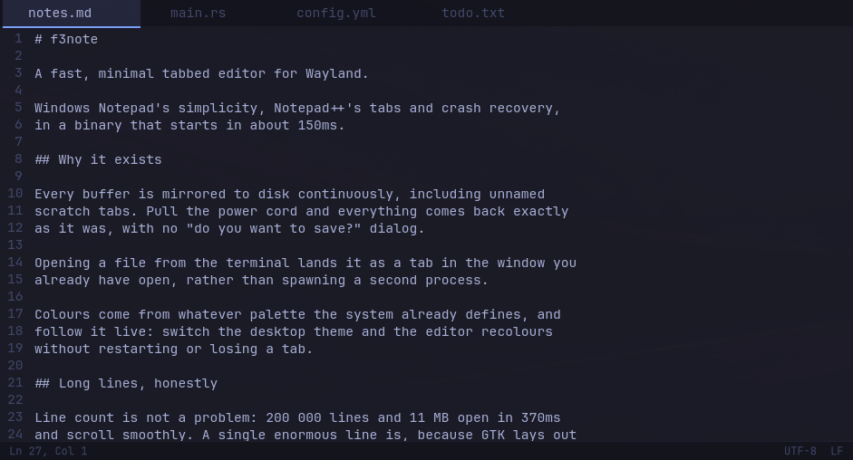
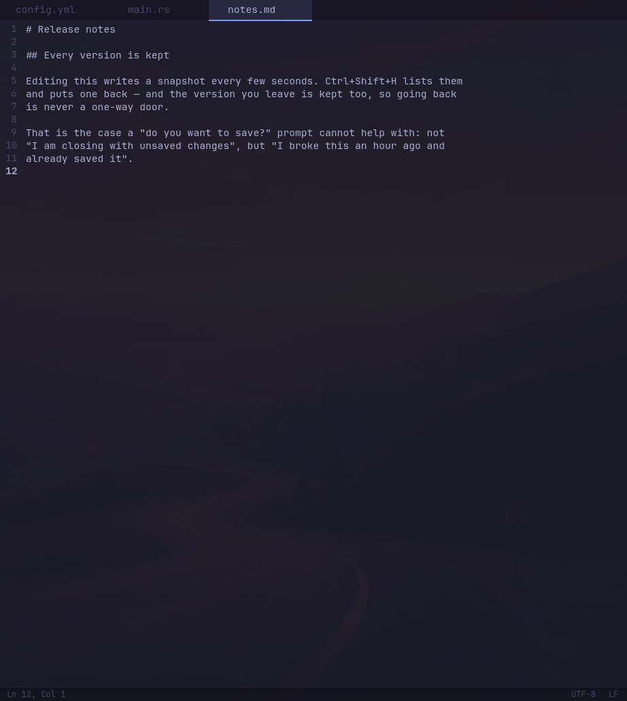
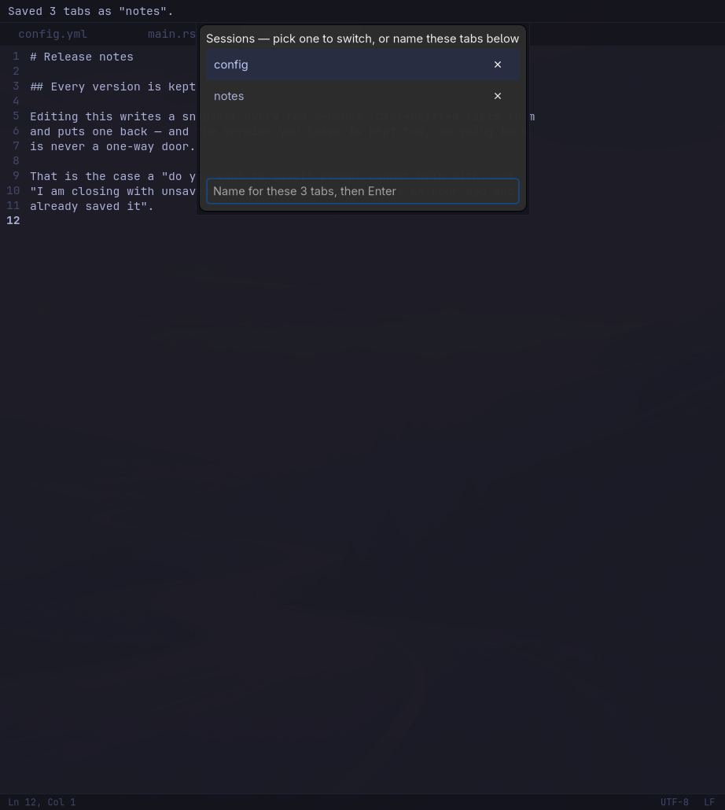
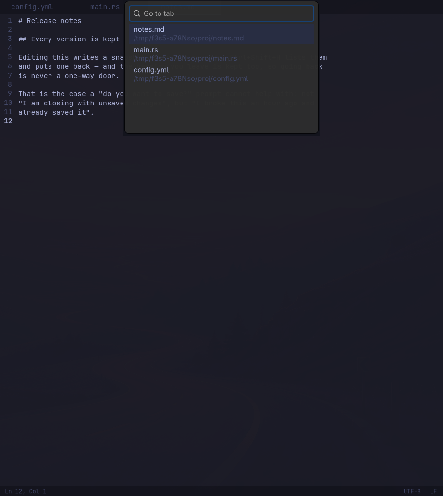
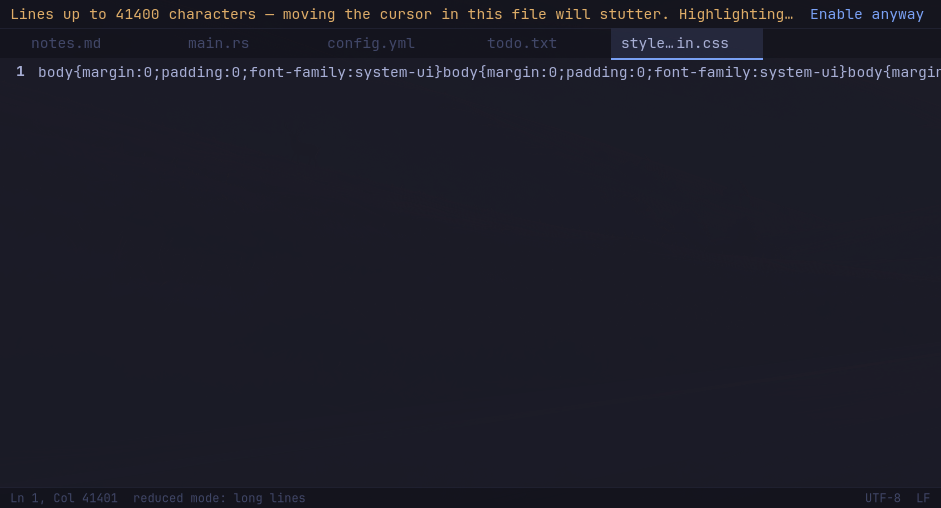

# f3note

A fast, minimal tabbed text editor for Wayland. Windows Notepad's simplicity,
Notepad++'s tabs and crash recovery, in a binary that opens in about 150ms.



Built for people running tiling compositors — Hyprland, Sway, river — but it
depends on nothing specific to them and runs on any desktop.

| | |
|---|---|
|  |  |
| Search the open tabs and the folder you are in | Named sets of tabs, switched without losing unsaved work |
|  |  |
| Jump to a tab, or reopen a recent file, by typing | Honest about the one thing it is bad at |

## What it does

**It does not lose your work.** Every buffer is mirrored to disk continuously,
including unnamed scratch tabs. Pull the power cord and everything comes back
exactly as it was. There is no "do you want to save?" dialog, because there is
nothing to ask about — that dialog exists for editors that cannot make this
promise.

**Tabs stay out of the way.** `Ctrl+T`, `Ctrl+W`, `Alt+1`..`Alt+9`, `Ctrl+Tab`
in most-recently-used order, and `Ctrl+P` to jump to a tab by typing part of
its name. Past a dozen tabs nobody reads a tab bar anyway.

**One window.** `f3note other.txt` from a terminal opens a tab in the window you
already have, rather than starting a second process. It works without a session
bus too, which is where most single-instance implementations quietly fail.

**It follows your theme.** Colours come from whatever palette your system
already defines, and follow it live — switch the desktop theme and the editor
recolours without restarting or losing a tab.

**You can go back.** Every version is kept as you work, so an edit you regret
an hour ago and already saved is still recoverable — which is exactly the case
a "do you want to save?" prompt cannot help with.

**It tells you the truth about its limits.** See below.

## Install

Clone it and build it. That is the supported route and the one that is tested
on every push.

```sh
git clone https://github.com/f360c4/f3note
cd f3note
cargo build --release
install -Dm755 target/release/f3note ~/.local/bin/f3note
install -Dm644 packaging/io.github.f360c4.f3note.desktop \
  ~/.local/share/applications/io.github.f360c4.f3note.desktop
install -Dm644 packaging/f3note.svg \
  ~/.local/share/icons/hicolor/scalable/apps/io.github.f360c4.f3note.svg
```

You need **GTK 4.12+**, **GtkSourceView 5.10+** and **Rust 1.92+**. That last
one is not a preference — the gtk-rs crates require it — and it is newer than
several distributions ship, so `rustup` may be easier than your package
manager's Rust.

| Distribution | Build dependencies | Works? |
|---|---|---|
| Arch, Manjaro, Omarchy | `pacman -S gtk4 gtksourceview5 rustup` | yes |
| Fedora 39+ | `dnf install gtk4-devel gtksourceview5-devel` | yes |
| Debian 13+ | `apt install libgtk-4-dev libgtksourceview-5-dev` | yes, with rustup |
| Ubuntu 24.04+ | `apt install libgtk-4-dev libgtksourceview-5-dev` | yes, with rustup |
| Alpine 3.20+ | `apk add gtk4.0-dev gtksourceview5-dev` | yes, with rustup |
| openSUSE Leap 16+ | `zypper in gtk4-devel gtksourceview5-devel` | yes |
| **Ubuntu 22.04, Debian 12, RHEL 9** | — | **no: GTK too old** |

There is an `.AppImage` on the [releases
page](https://github.com/f360c4/f3note/releases). Be aware of what it is and
is not: it needs glibc 2.39 or newer, because that is what the machine that
builds it has. An AppImage is usually a way onto *older* systems, and this one
is not — the systems old enough to need it are also too old to build it. It
saves you installing a toolchain, nothing more.

Not packaged for any distribution yet. An AUR `PKGBUILD` is in `packaging/`
and works, but has not been submitted.

## Keyboard

| | |
|---|---|
| `Ctrl+O` | open a file — or drop one on the window |
| `Ctrl+S` / `Ctrl+Shift+S` | save / save as |
| `Ctrl+Shift+R` | revert — discard changes and reload from disk |
| `Ctrl+Shift+H` | earlier versions of this file |
| `Ctrl+T` / `Ctrl+W` | new tab / close tab |
| `Ctrl+Shift+W` | close and forget — also deletes what f3note stored about it |
| `Alt+1`..`Alt+8`, `Alt+9` | jump to tab by position; `Alt+9` is the last tab |
| `Ctrl+Tab` | previously used tab, not the next one along |
| `Ctrl+P` | jump to a tab, or reopen a recent file, by typing |
| `Ctrl+Shift+E` | named sessions — save and switch sets of tabs |
| `Ctrl+F` / `Ctrl+H` | find / find and replace |
| `Ctrl+Shift+F` | search the open tabs and this folder |
| `Ctrl+K` / `Ctrl+Shift+K` | next / previous match |
| `Ctrl+G` | go to line |
| `Ctrl+D` | duplicate line or selection |
| `Alt+Up` / `Alt+Down` | move line or selection |
| `Ctrl+/` | comment or uncomment |
| `Ctrl++` / `Ctrl+-` / `Ctrl+0` | zoom in / out / reset — also `Ctrl+Scroll` |
| `Ctrl+Q` | quit |

The encoding and line-ending fields in the status bar are clickable.

Your compositor's close-window shortcut works too. f3note will not stop you
with a dialog: everything is already mirrored, so closing is always safe.

## Configuration

Entirely optional — every setting has a working default and the file does not
need to exist. See [docs/config.example.toml](docs/config.example.toml), which
explains why each default is what it is.

```toml
[appearance]
opacity = 0.9              # needs a compositor blur rule to be worth anything
syntax_highlighting = true # off by default: it should open like a notepad
```

Colours cascade: your Omarchy theme if you have one, then
`~/.config/f3note/theme.toml`, then the desktop's light/dark preference. On an
Omarchy system the palette f3note resolves is identical to the one every other
themed application resolves — verified key by key across all 22 themes.

## Honest limits

**Long lines, not large files.** 200 000 lines and 11 MB open in 370ms and
scroll smoothly, because only the lines on screen are laid out. A single
enormous line is different: GTK lays out a whole logical line at once, so
finding the cursor's column means shaping every character in it. Minified CSS
and single-line JSON make the cursor stutter, and no setting removes that.

f3note detects such files, turns off what it can, and says so rather than
pretending the problem is handled.

**No split view, no multiple cursors, no plugins, no LSP.** Deliberately. If
you want those, you want a different editor, and there are good ones.

**Searching is scoped to your tabs and the folder you are in.** `ripgrep` is
better at searching a codebase and f3note is not trying to replace it.

## Building and testing

```sh
./scripts/test.sh        # everything below, in one go
cargo test               # logic tests, no display required
./target/release/uitest  # drives the real window: tabs, find, popovers
./scripts/crashtest.sh   # end-to-end: edit, SIGKILL, recover
```

`scripts/test.sh` also runs clippy, checks the palette against the system's own
resolver, measures startup against its 200ms budget, and measures how long the
main loop stalls on a line at the configured limit. The window test runs under
`G_DEBUG=fatal-criticals`, so a GTK critical fails the build rather than
scrolling past.

## License

MIT. See [LICENSE](LICENSE).

f3note links GTK4 and GtkSourceView5, which are LGPL-2.1-or-later. Binary
bundles link them dynamically and ship their licence texts, so they can be
replaced. See [docs/LICENSING.md](docs/LICENSING.md).
